# Automate EKS deployment in secure Way with Prisma Cloud

### Purpose

This repository provides a lab to show deployment of an EKS cluster and its associated infrastructure  (VPC, SG, S3, etc.) in an automated way with GitHub Action and in an secure way with Prisma Cloud.

It is possible to use this code to quickly deploy a cloud native environment (K8s) for demonstration purposes.


### High Level Diagram

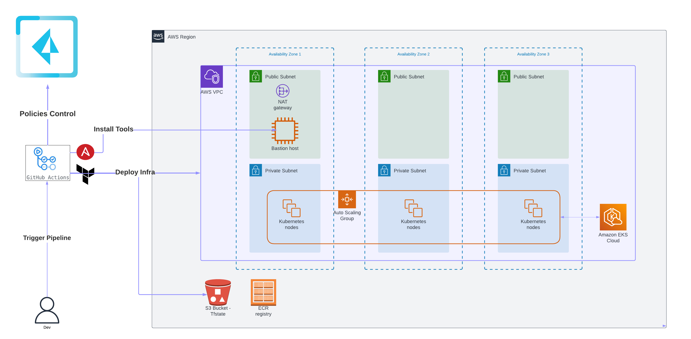


### Sequence Diagram

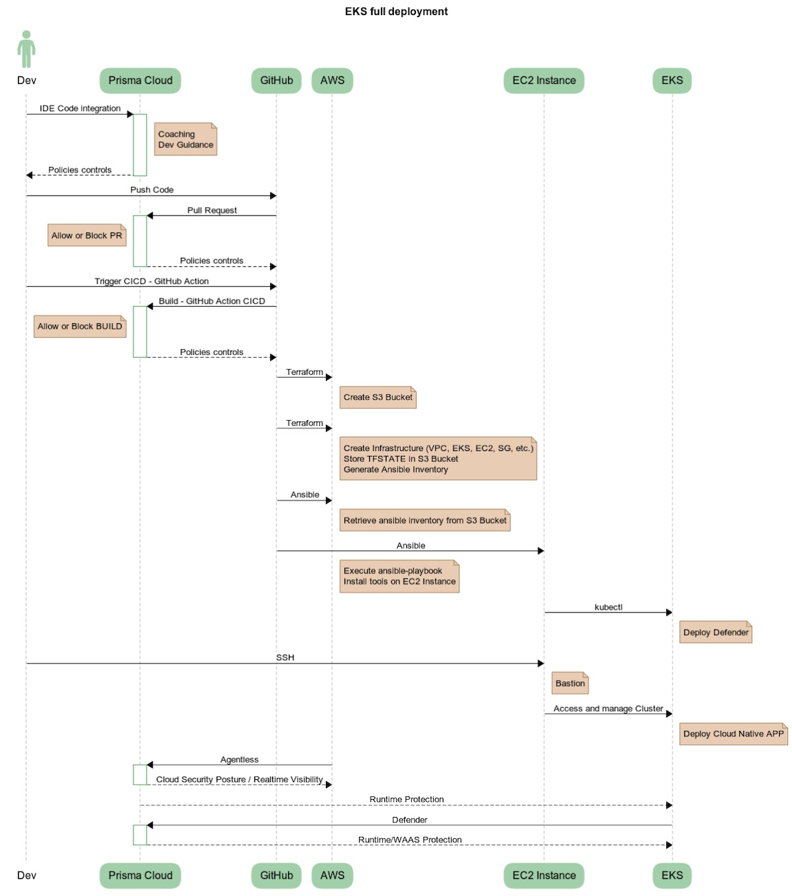


### Roll out Lab Deployment

#### Requirements

- **GitHub Account** to create private fork
- **AWS Subscription** with Programmatic Access (**AWS_ACCESS_KEY_ID / AWS_SECRET_ACCESS_KEY** )
- **Prisma Cloud Tenant** with AccessKey & Secret
- **SSH Key**


#### Create a fork of the repository

1. Login with your github account
2. Open https://github.com/cleypanw/prisma-cloud-terraform-aws-eks and click on Fork


#### Configure GitHub Action Secrets

Open **Settings > Security > Secrets and variables > Actions** 

- <u>**Secrets**</u>
  - **AWS_ACCESS_KEY_ID** 
  - **AWS_SECRET_ACCESS_KEY**
  - **PC_ACCESS_KEY** (Prisma Cloud Access Key)
  - **PC_SECRET_KEY** (Prisma Cloud Secret Key)
  - **SSH_PRIVATE_KEY** (Private key yes, will be used by ansible to connect to bastion instance to install tools)


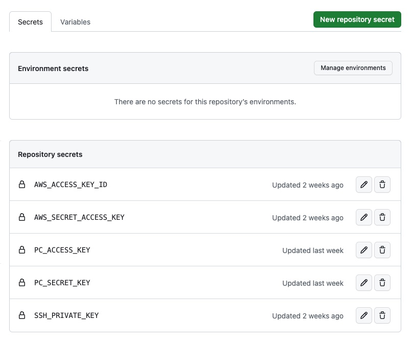

### Deploy Infrastructure Workflow 

1) Open **Actions > All Workflows > Deploy Infrastructure** 


2) Click on `Run workflow` , and **set your configuration**

   

- AWS region in which to deploy the infrastructure (Mandatory) : **default = eu-west-3**

- Prisma Cloud API URL (Mandatory) : **default = https://api2.eu.prismacloud.io**

- Prefix name for resources to be created: s3 bucket, vpc, eks, ec2, etc : **default = eks** 

  *(all AWS resources created will be prefix, don't worry if you already have resources with this prefix, a random character string is also generated as a suffix,  under the hood in the code, so each deployment will have a unique name, even if the same prefix is used several time)*

- Number of worker nodes in eks_cluster : **default = 3** (choice between 1 to 5)

- Worker nodes type in eks_cluster : **default = t3.medium** 

- Public ssh key to connect to ec2-bastion host : **Your SSH PUBLIC KEY**

  

3. Click  `Run workflow`, and deployment will start

4. You can monitor the deployment of all stages 

   


*NB: click on the stage to have details* ie ansible stage below 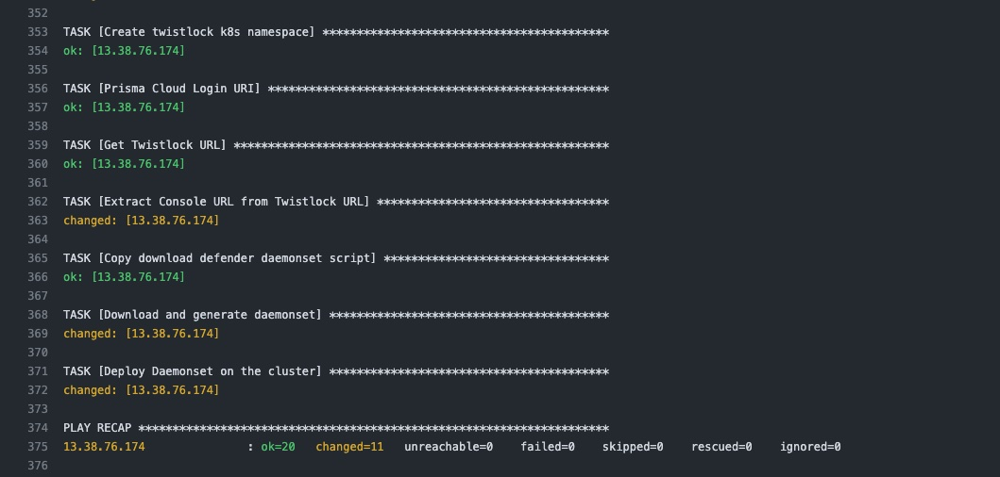


5. Retrieve the terraform outputs to connect to the instance by clicking on the`Deploy infra - Terraform Apply` job and scrolling to the bottom of this stage.

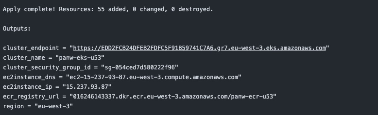


**🎉 Congratulations your AWS Environment is now deployed, and your EKS cluster is discovered on Prisma Cloud  🎉**


*NB : deployment time is about 15 min*


#### Check the cluster on Prisma Cloud

**Defender is deployed during deployment on the cluster**, check if the cluster appears well in the Radar view of Prisma Cloud.

1. Connect on Prisma Cloud 

2. Go to **Compute / Radars / Containers**

   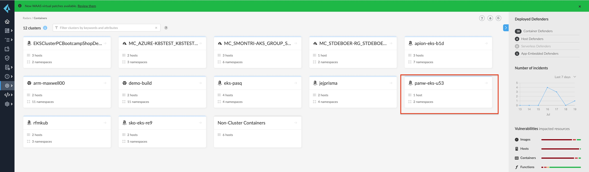

3. Click on your cluster

   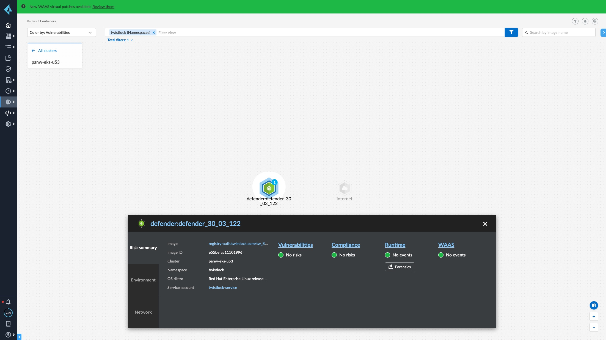

4. Check if Defender is connected, go to **Compute / Manage / Defenders**

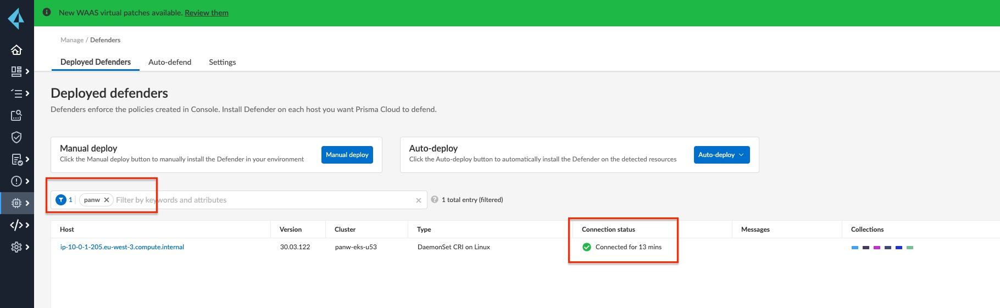


#### Connect to your EKS and deploy application

<u>EKS **public** API server endpoint is **disabled**</u>, only <u>EKS **private** API server endpoint is **enabled**</u> 

It is only possible to connect to the Kubernetes cluster APIs via the **ec2-bastion instance**.


1) Connect to ec2-bastion with your ssh private key and user **Ubuntu** and IP retrieve from TF output (ec2instance_ip)

   ```shell
   ssh -i <ssh_private_key> ubuntu@${TF_output_ec2instance_ip}
   ```

   

2. Configure your AWS account (example you can use aws configure cli command)

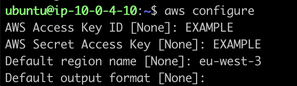


3. Retrieve the name of your cluster (either from the terraform output or via aws cli)

   ```shell
   aws eks list-clusters
   ```

   

   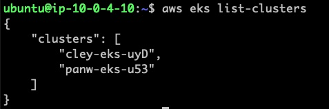


4. Update Kubeconfig

   ```shell
   aws eks update-kubeconfig --name ${eks_cluster_name}
   ```

   *Example*:

   


5. You can now manage your cluster and deploy applications (with kubectl by example)

   

6. Optional - Test - deploy application

   ```shell
   kubectl run weather-alpine --image=chrisley75/weather-alpine:0.2 -l app=weather-alpine --expose --port=8080
   kubectl patch svc weather-alpine -p '{"spec": {"type": "LoadBalancer"}}'
   kubectl get all
   NAME                 READY   STATUS    RESTARTS   AGE
   pod/weather-alpine   1/1     Running   0          96s
   
   NAME                     TYPE           CLUSTER-IP     EXTERNAL-IP                                                               PORT(S)          AGE
   service/kubernetes       ClusterIP      172.20.0.1     <none>                                                                    443/TCP          6h18m
   service/weather-alpine   LoadBalancer   172.20.69.39   a9e504e4734c44212bd738f8dc3a302e-1865608803.eu-west-3.elb.amazonaws.com   8080:31471/TCP   96s
   ```

   


🎉 **Congratulations your EKS Cluster is fully functionnal.** 🎉


### Delete Infrastructure Workflow 

1. Open Actions > All Workflows > Delete Infrastructure 

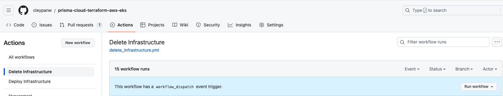


2. Click on `Run workflow` , and **fill in the fields **

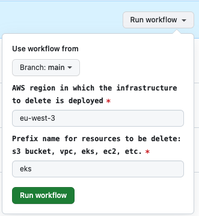

- AWS region in which the infrastructure to delete is deployed : **default = eu-west-3** (the region where is deployed your AWS infra)
- Prefix name for resources to be delete: s3 bucket, vpc, eks, ec2, etc. : **default = eks** (prefix set during build stage) 


3. Click  `Run workflow`, and delete will start


# Prisma Cloud integration 

Throughout the deployment, Prisma was involved in the control of Policies from the code to the cloud.


## Code Security Capabilities


### IDE integration (without open Prisma Cloud Console)


### VSC integration (during PR)

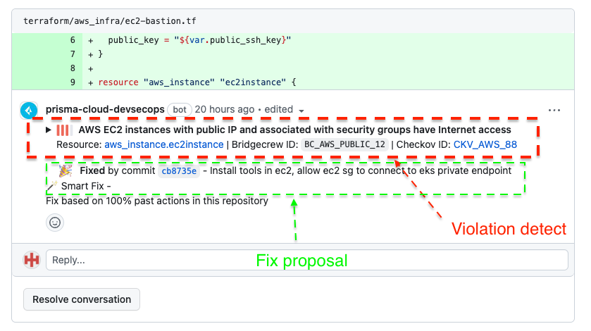


### CICD integration (Build stage)


### Prisma Cloud Console

#### VCS Project view


#### CICD Run result

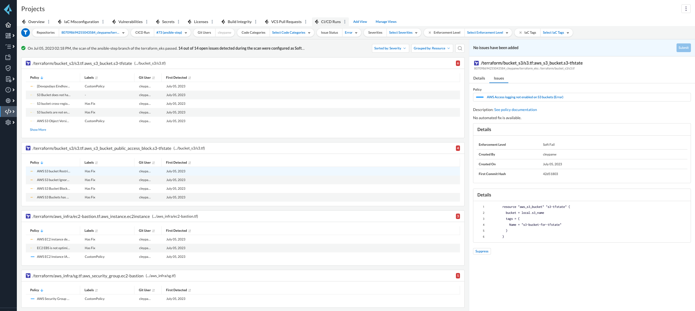


#### Code Security Dashboard

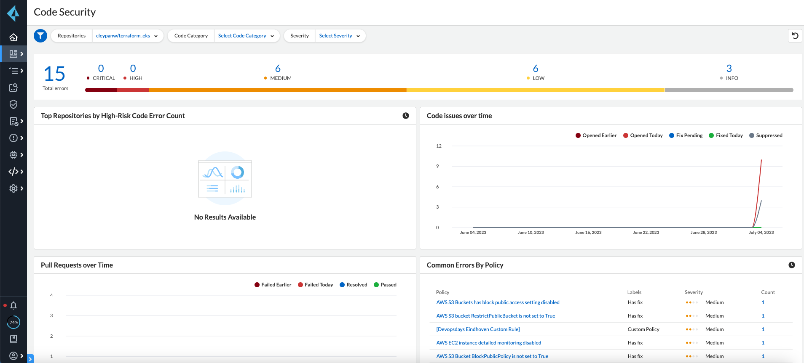


#### Supply Chain Graph

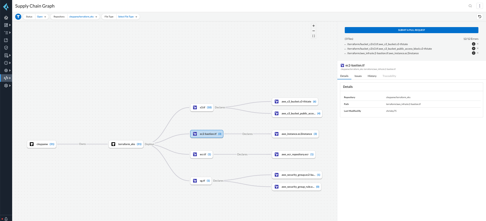


#### Enforcement Rules configuration

*NB: Possibility of blocking the PR without being able to merge it or Build deployment,  depends on the security code configuration enforcement rules in Prisma Cloud*

